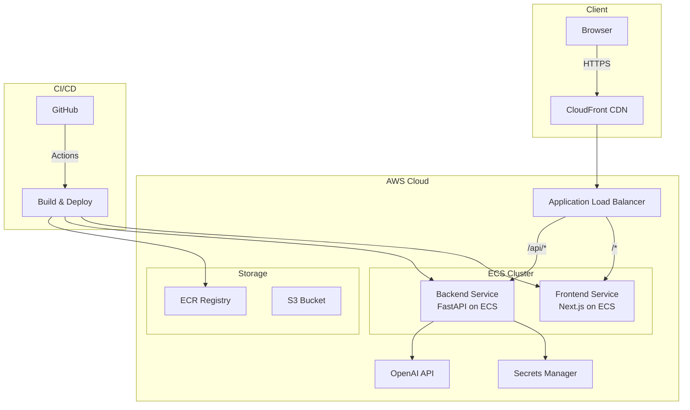

# AI Code Review Assistant
# 🤖 AI Code Review Assistant

<div align="center">
  
  
  
  
  
  
  
</div>

<div align="center">
  <h3>
    <a href="https://code.yijunxiang.com">🌐 Live Demo</a>
    <span> | </span>
    <a href="#-features">Features</a>
    <span> | </span>
    <a href="#-tech-stack">Tech Stack</a>
    <span> | </span>
    <a href="#-architecture">Architecture</a>
    <span> | </span>
    <a href="#-deployment">Deployment</a>
  </h3>
</div>

<div align="center">
  <sub>Built with ❤️ by <a href="https://yijunxiang.com">Yijun Xiang</a></sub>
</div>

---

## 📋 Overview

AI Code Review Assistant is an intelligent web application that leverages OpenAI's GPT models to provide instant, comprehensive code reviews. Simply paste your code snippet, and receive AI-powered insights on bugs, security vulnerabilities, performance optimizations, and adherence to best practices.

### 🎯 Why This Project?

This project demonstrates the seamless integration of cutting-edge technologies:
- **Large Language Models (LLMs)**: Practical application of AI in software development
- **Cloud Native Architecture**: Microservices deployed on AWS ECS with auto-scaling
- **Modern Full-Stack Development**: React/Next.js frontend with FastAPI backend
- **DevOps Best Practices**: Infrastructure as Code, CI/CD, containerization

## ✨ Features

### 🔍 Intelligent Code Analysis
- **Multi-Language Support**: Python, JavaScript, TypeScript, Java, Go, Rust, C++, and more
- **Comprehensive Review**: Bug detection, security analysis, performance optimization
- **Best Practices**: Adherence to language-specific style guides (PEP 8, ESLint, etc.)
- **Actionable Suggestions**: Line-by-line improvements with clear explanations

### 🎨 Modern User Experience
- **Real-time Analysis**: Instant feedback powered by GPT-3.5/4
- **Syntax Highlighting**: Beautiful code display with Monaco Editor
- **Responsive Design**: Works seamlessly on desktop and mobile
- **Dark Mode**: Easy on the eyes for extended coding sessions

### 🔧 Technical Excellence
- **Scalable Architecture**: Microservices on AWS ECS Fargate
- **High Availability**: Multi-AZ deployment with load balancing
- **Secure**: HTTPS, API key encryption, AWS Secrets Manager
- **Fast**: Optimized builds, CDN delivery, efficient caching

## 🛠️ Tech Stack

### Backend
- **Framework**: FastAPI (Python 3.11)
- **AI Integration**: 
  - OpenAI API (GPT-3.5/4)
  - LangChain for prompt engineering
- **API Design**: RESTful with OpenAPI/Swagger documentation
- **Containerization**: Docker with multi-stage builds

### Frontend
- **Framework**: Next.js 14 (React 18)
- **Language**: TypeScript 5.0
- **Styling**: Tailwind CSS with custom animations
- **Code Editor**: Monaco Editor (VS Code's editor)
- **State Management**: React Hooks + Context

### Infrastructure
- **Cloud Provider**: AWS
  - ECS Fargate for container orchestration
  - Application Load Balancer
  - ECR for Docker registry
  - Route 53 for DNS
  - Certificate Manager for SSL
  - Secrets Manager for API keys
- **Infrastructure as Code**: Terraform
- **CI/CD**: GitHub Actions
- **Monitoring**: CloudWatch

## 🏗️ Architecture



## 🚀 Deployment

### Prerequisites
- AWS Account with appropriate permissions
- Docker installed locally
- Terraform >= 1.5
- Node.js >= 20
- Python >= 3.11

### Quick Start

1. **Clone the repository**
   ```bash
   git clone https://github.com/yourusername/ai-code-review-assistant.git
   cd ai-code-review-assistant
   ```

2. **Set up environment variables**
   ```bash
   # Backend
   cp backend/.env.example backend/.env
   # Add your OpenAI API key

   # Frontend
   cp frontend/.env.local.example frontend/.env.local
   ```

3. **Deploy infrastructure**
   ```bash
   cd infrastructure
   terraform init
   terraform plan
   terraform apply
   ```

4. **Deploy application**
   ```bash
   # Push to main branch triggers automatic deployment
   git push origin main
   ```

### Manual Deployment

<details>
<summary>Click to expand manual deployment steps</summary>

#### Backend
```bash
cd backend
docker build -t ai-code-review-backend .
docker tag ai-code-review-backend:latest YOUR_ECR_URL/backend:latest
docker push YOUR_ECR_URL/backend:latest
```

#### Frontend
```bash
cd frontend
docker build -t ai-code-review-frontend .
docker tag ai-code-review-frontend:latest YOUR_ECR_URL/frontend:latest
docker push YOUR_ECR_URL/frontend:latest
```

</details>

## 📚 API Documentation

The API documentation is automatically generated and available at:
- Production: https://code.yijunxiang.com/docs
- Local: http://localhost:8000/docs

### Example Request

```bash
curl -X POST "https://code.yijunxiang.com/api/v1/review" \
  -H "Content-Type: application/json" \
  -d '{
    "code": "def fibonacci(n):\n    if n <= 1:\n        return n\n    return fibonacci(n-1) + fibonacci(n-2)",
    "language": "python"
  }'
```

### Example Response

```json
{
  "overall_score": 6.5,
  "summary": "The code is functional but has performance issues",
  "suggestions": [
    {
      "line_number": 3,
      "severity": "warning",
      "category": "performance",
      "message": "Recursive implementation has exponential time complexity",
      "suggestion": "Consider using dynamic programming or memoization"
    }
  ]
}
```

## 🧪 Testing

### Backend Tests
```bash
cd backend
pytest tests/ -v --cov=app
```

### Frontend Tests
```bash
cd frontend
npm test
npm run test:e2e
```

## 📈 Performance

- **API Response Time**: < 2s average (including AI processing)
- **Frontend Load Time**: < 1s (optimized with Next.js SSG/ISR)
- **Availability**: 99.9% uptime with multi-AZ deployment
- **Scalability**: Auto-scaling based on CPU/memory metrics

## 🤝 Contributing

Contributions are welcome! Please read our [Contributing Guide](CONTRIBUTING.md) for details on our code of conduct and the process for submitting pull requests.

### Development Setup

1. Fork the repository
2. Create your feature branch (`git checkout -b feature/AmazingFeature`)
3. Commit your changes (`git commit -m 'Add some AmazingFeature'`)
4. Push to the branch (`git push origin feature/AmazingFeature`)
5. Open a Pull Request

## 📄 License

This project is licensed under the MIT License - see the [LICENSE](LICENSE) file for details.

## 🙏 Acknowledgments

- OpenAI for providing the GPT API
- The FastAPI and Next.js communities
- AWS for cloud infrastructure
- All contributors and testers

## 📧 Contact

**Yijun Xiang** - [yijunxiang.com](https://yijunxiang.com)

Project Link: [https://github.com/yourusername/ai-code-review-assistant](https://github.com/yourusername/ai-code-review-assistant)

---

<div align="center">
  <p>If you found this project helpful, please consider giving it a ⭐️!</p>
  <a href="https://www.buymeacoffee.com/yourusername">
    
  </a>
</div>